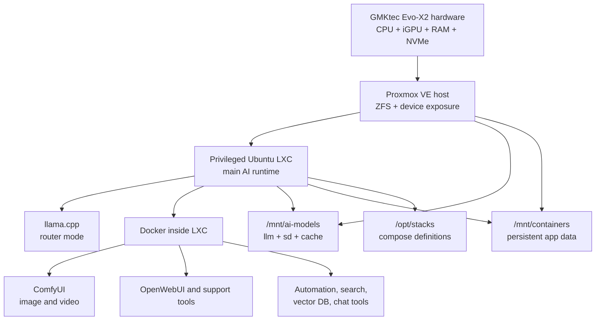

# GMKtec Evo-X2 Local AI Stack

Reference documentation and public-safe examples for a local AI workstation stack built around the GMKtec Evo-X2.

This repository documents a practical setup based on:

- `GMKtec Evo-X2`
- `AMD Ryzen AI Max+ 395`
- `Radeon 8060S / gfx1151`
- `128 GB RAM`
- `Proxmox VE -> privileged Ubuntu LXC -> Docker`

It focuses on the parts that are useful to other builders:

- architecture and deployment choices
- `llama.cpp` router-mode operation on AMD hardware
- ComfyUI image and video paths
- manual ComfyUI workflow examples
- MCP servers for practical image-generation workflows
- MCP search integration through a local search backend
- model storage layout
- sanitized configuration examples

## Why This Repo Exists

Many local AI writeups are either too abstract to reproduce or too tied to one private environment to publish safely.

This repository tries to sit in the useful middle:

- concrete enough to copy ideas from
- opinionated enough to be operationally interesting
- sanitized enough to be publishable

It is not trying to be:

- a one-command installer
- a complete dump of a live private environment
- a universal best-practice guide for every homelab

## At a Glance

- hardware reference: `GMKtec Evo-X2`, `Ryzen AI Max+ 395`, `Radeon 8060S`, `128 GB RAM`
- platform shape: `Proxmox -> privileged Ubuntu LXC -> Docker`
- LLM path: `llama.cpp` in router mode, built for HIP/ROCm
- image path: `ComfyUI` with `FLUX.2 klein 9B Q5 GGUF`
- fallback image path: `Juggernaut XL Lightning`
- video path: `LTX 2.3`
- storage shape: `ZFS`, mirrored NVMe, dedicated model and app-data trees

## Architecture

The working design is based on three layers:

1. `Proxmox VE` on bare metal
2. one privileged Ubuntu `LXC` as the main AI runtime
3. `Docker` inside that LXC for user-facing and support services

The practical bias of the stack is:

- keep the Proxmox host lean
- run `llama.cpp` close to the metal inside the LXC
- run web tools and support services in Docker
- keep models and persistent service data on mounted storage
- separate LLM, diffusion, cache, and app-data concerns clearly



For the full diagram and rationale, see [docs/architecture.md](docs/architecture.md).

## From-Scratch Baseline

The documented reference machine is not treated as a stock Windows mini PC with AI tools added later.

The reference starting point is:

- `GMKtec Evo-X2`
- `AMD Ryzen AI Max+ 395`
- `Radeon 8060S / gfx1151`
- `128 GB RAM`
- original Windows SSD removed
- `2 x 4 TB NVMe` used for mirrored Proxmox ZFS storage

That baseline matters because it explains the rest of the design:

- dedicated AI host
- ZFS-backed persistence
- direct GPU device exposure into LXC
- no Windows GPU passthrough story

For the full setup direction, see [docs/from-scratch.md](docs/from-scratch.md).

## What Is Included

This repository currently includes:

- architecture notes
- hardware and platform notes
- storage and ZFS notes
- `llama.cpp` backend documentation
- a public-safe `llama.cpp` management script
- public-safe MCP server scripts for ComfyUI
- a public-safe MCP search server example
- a public-safe SearXNG stack example that complements the MCP search server
- simplified workflow diagrams for the published ComfyUI workflow families
- model layout and model tree documentation
- sanitized example configuration files
- example stack environment files for selected services

## Start Here

Recommended reading order:

1. [docs/from-scratch.md](docs/from-scratch.md)
2. [docs/architecture.md](docs/architecture.md)
3. [docs/stack-overview.md](docs/stack-overview.md)
4. [docs/deployment-order.md](docs/deployment-order.md)
5. [docs/service-boundaries.md](docs/service-boundaries.md)
6. [docs/llama-backend.md](docs/llama-backend.md)
7. [docs/memory-recycling.md](docs/memory-recycling.md)
8. [docs/lxc-layout.md](docs/lxc-layout.md)
9. [docs/model-layout.md](docs/model-layout.md)
10. [docs/proxmox-zfs-helper.md](docs/proxmox-zfs-helper.md)

If you only care about the local LLM path, go straight to:

1. [docs/llama-backend.md](docs/llama-backend.md)
2. [examples/llama/README.md](examples/llama/README.md)
3. [scripts/llama/update-llama.sh](scripts/llama/update-llama.sh)

If you care about the practical image-generation integration layer, also see:

1. [docs/mcp-comfyui.md](docs/mcp-comfyui.md)
2. [examples/mcp/README.md](examples/mcp/README.md)
3. [scripts/mcp/comfyui_mcp_v2.py](scripts/mcp/comfyui_mcp_v2.py)
4. [examples/comfyui-workflows/README.md](examples/comfyui-workflows/README.md)
5. [docs/comfyui-workflow-diagrams.md](docs/comfyui-workflow-diagrams.md)

If you care about the practical search integration layer, also see:

1. [docs/mcp-search.md](docs/mcp-search.md)
2. [examples/mcp/searxng.env.example](examples/mcp/searxng.env.example)
3. [scripts/mcp/searxng_mcp.py](scripts/mcp/searxng_mcp.py)
4. [examples/stacks/search/README.md](examples/stacks/search/README.md)

If you want to wire these MCP servers into Codex, see:

1. [docs/mcp-codex.md](docs/mcp-codex.md)
2. [examples/mcp/README.md](examples/mcp/README.md)

## What You Must Decide Before Deployment

If you are adapting this repository to a real machine, decide these things first:

- whether your runtime boundary will be `Proxmox -> privileged LXC -> Docker` or something else
- where your persistent storage roots will live
- where your model tree will live
- whether services will talk over loopback, LAN IPs, or a reverse proxy
- which models you actually want to support
- whether your MCP scripts run on the same host as the services they call

In practice, an AI agent trying to deploy this for someone should collect these values before editing configs:

- host OS and hypervisor choice
- container or VM choice
- storage roots such as `/mnt/ai-models` and `/mnt/containers`
- real service URLs and ports
- Python path for MCP servers
- actual model filenames to be used in `models.ini` or MCP environment variables

Without those decisions, the examples are still useful, but they are not yet deployable.

## What You Will Need To Customize

Almost every real deployment will need local edits in these categories:

- IP addresses, hostnames, and base URLs
- storage paths and mount points
- model filenames
- Python interpreter paths
- Docker image tags and exposed ports
- router presets in `models.ini`
- MCP environment variables such as `COMFYUI_BASE_URL` and `SEARXNG_URL`
- exported ComfyUI workflow JSON files, if you copy them into your own UI workflow library

Treat the examples as structurally correct starting points, not as files that should be copied unchanged.

## `llama.cpp` Path

The local LLM serving path is documented in three layers:

- operational overview: [docs/llama-backend.md](docs/llama-backend.md)
- required directories and example config: [examples/llama/README.md](examples/llama/README.md)
- public-safe management script: [scripts/llama/update-llama.sh](scripts/llama/update-llama.sh)

Important assumption:

- this repository does not include model files
- you must download your own models into the expected directory
- you must adapt `models.ini` to match your own installed models and routing choices

## Network and IP Assumptions

All addresses, hostnames, and service URLs in this repository should be treated as examples.

If you reuse these examples, you must adapt them to your own environment:

- local IP addresses must match your own LAN layout
- loopback addresses such as `127.0.0.1` only make sense when the client and service run on the same machine
- if the service runs on another host, replace loopback addresses with the real host address, for example something in your own LAN such as `192.168.1.x`
- ports and base URLs must match the way you actually expose services in your setup

This matters especially for:

- Codex MCP configuration
- ComfyUI MCP integration
- SearXNG MCP integration
- stack `.env` files and compose examples

Do not assume that an address shown in this repository is meant to be used unchanged.

## Manual ComfyUI Workflows

This repository also includes exported manual workflow JSON files for ComfyUI:

- Flux image generation and editing examples
- basic LTX video examples
- a simple upscale example

See:

- [examples/comfyui-workflows/README.md](examples/comfyui-workflows/README.md)

If you want to use them in the ComfyUI UI, place them in the normal workflow directory:

- `/opt/ComfyUI/user/default/workflows`

If your setup mounts the ComfyUI user directory from the host, place them under the corresponding mounted path instead. In the media stack example from this repository, that means:

- `${COMFYUI_DATA_ROOT}/user/default/workflows`

## Minimal Validation Checklist

After adapting the examples, a deployment is only meaningfully “working” if at least these checks pass:

- the host sees the AMD GPU devices correctly
- the LXC can access `/dev/dri` and `/dev/kfd`
- the model directories exist and are mounted where the configs expect them
- `llama.cpp` starts and can see the models referenced in `models.ini`
- ComfyUI starts and can see the required model assets
- MCP servers can reach their target services through the configured base URLs
- generated files land in the expected output paths

If one of those assumptions is false, the examples may still look correct while the deployment itself is broken.

## Current Model and Workflow Direction

The current stack is biased toward:

- `llama.cpp` in router mode for LLM serving
- `FLUX.2 klein 9B Q5 GGUF` as the preferred image path
- `Juggernaut XL Lightning` as a fallback image path
- `LTX 2.3` as the current video path

The models tree is intentionally documented as a public example because the structure itself is useful. It shows:

- flat GGUF storage for standard LLMs
- directory-shaped multimodal models with paired files
- diffusion assets split by role
- symlink-based deduplication patterns
- active versus archived asset organization

See:

- [docs/model-layout.md](docs/model-layout.md)
- [docs/model-tree-snapshot.md](docs/model-tree-snapshot.md)
- [examples/README.md](examples/README.md)

## Repository Layout

```text
GMKtec-Evo-X2-public/
├── README.md
├── SECURITY.md
├── LICENSE.md
├── CONTRIBUTING.md
├── docs/
├── examples/
└── scripts/
```

Main areas:

- [docs](docs) for architecture, platform, storage, and operational notes
- [examples](examples) for sanitized example configs
- [scripts](scripts) for public-safe helper scripts worth publishing

## Documentation and Safety

Additional repository guidance is documented in:

- [docs/README.md](docs/README.md)
- [SECURITY.md](SECURITY.md)
- [LICENSE.md](LICENSE.md)

## License and Risk

This repository is provided as free software and free documentation:

- use at your own risk
- no warranty
- documentation and examples may contain mistakes
- some guidance may become outdated over time

See [LICENSE.md](LICENSE.md).
