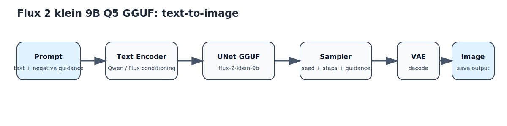
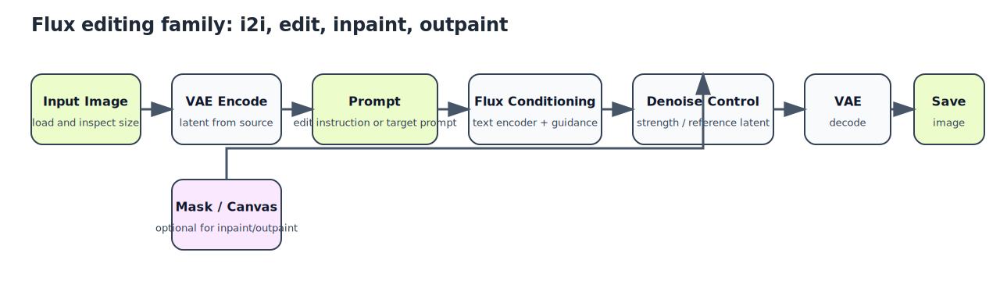
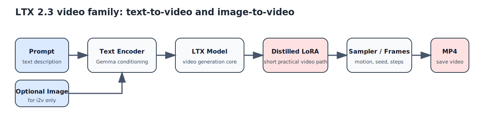

# ComfyUI Workflow Diagrams

This document provides simplified visual references for the exported ComfyUI workflows published in this repository.

These are not literal GUI screenshots.

They are intentionally simplified diagrams that show the practical logic of each workflow family without requiring the reader to import JSON first.

## Flux Text-to-Image

This corresponds most closely to:

- [../examples/comfyui-workflows/flux2_klein_9b_q5_gguf_t2i.json](../examples/comfyui-workflows/flux2_klein_9b_q5_gguf_t2i.json)

## Flux Editing and Image-to-Image

This reflects the shape of:

- [../examples/comfyui-workflows/flux2_klein_9b_q5_gguf_i2i.json](../examples/comfyui-workflows/flux2_klein_9b_q5_gguf_i2i.json)
- [../examples/comfyui-workflows/flux2_klein_9b_q5_gguf_edit.json](../examples/comfyui-workflows/flux2_klein_9b_q5_gguf_edit.json)
- [../examples/comfyui-workflows/flux2_klein_9b_q5_gguf_inpaint.json](../examples/comfyui-workflows/flux2_klein_9b_q5_gguf_inpaint.json)
- [../examples/comfyui-workflows/flux2_klein_9b_q5_gguf_outpaint.json](../examples/comfyui-workflows/flux2_klein_9b_q5_gguf_outpaint.json)

## LTX Video

This reflects the shape of:

- [../examples/comfyui-workflows/ltx_2_3_t2v_fast.json](../examples/comfyui-workflows/ltx_2_3_t2v_fast.json)
- [../examples/comfyui-workflows/ltx_2_3_i2v_short.json](../examples/comfyui-workflows/ltx_2_3_i2v_short.json)

## Why These Diagrams Exist

- They make the repository easier to scan on GitHub.
- They help users decide which workflow to import before opening JSON files.
- They give AI agents and human operators a quick conceptual map of the workflow families used by the stack.
